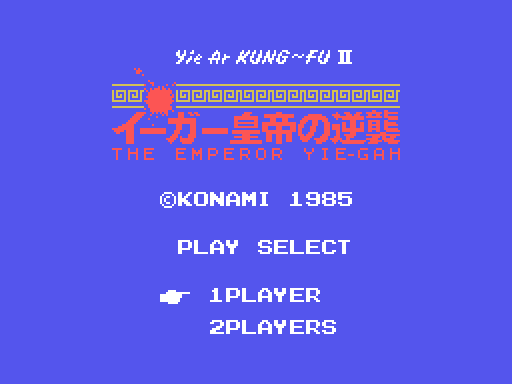
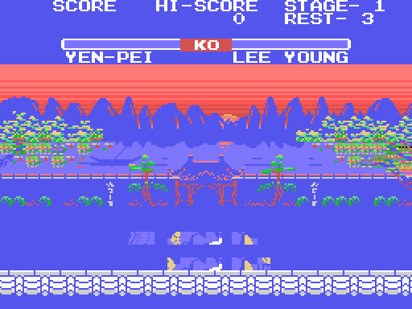
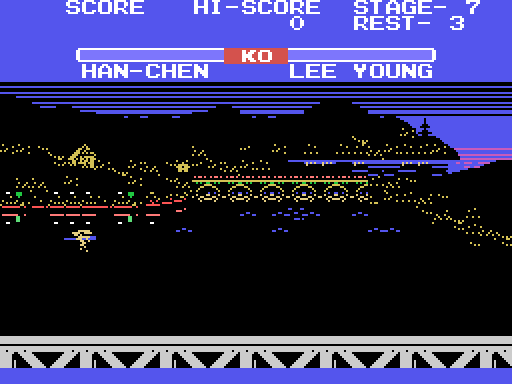
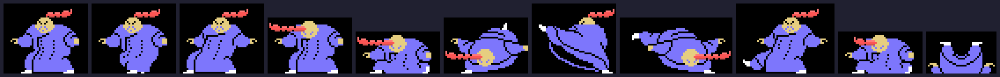
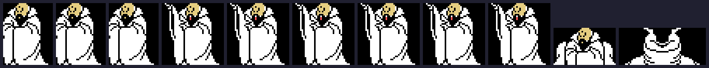
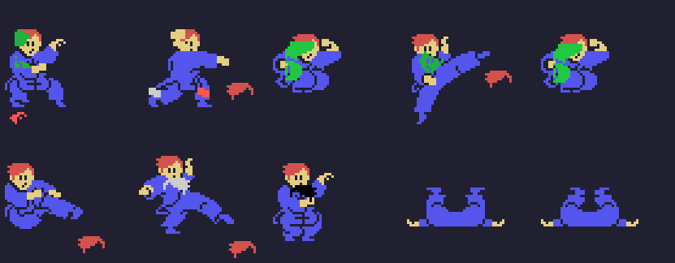

# The game

*The title screen, built by `0x4CE9` and placed by `0x4D10`. It is not a
capture: it is drawn from the ROM, and checked against openMSX's VRAM at 768 of
768 tiles.*

LEE YOUNG works his way through **eight sceneries**, one rival each, up to the
emperor Yie-Gah. Between fights come the **wave screens**, where the enemies
arrive in a row.

## The eight rivals

Their names are eight scripts hanging off the pointer table at `0x4487`, indexed
by the scenery of the round; the one you play is at `0x447B`.

| round | rival | backdrop |
|---|---|---|
| 1 | YEN-PEI | 0 |
| 2 | LAN-FANG | 0 |
| 3 | PO-CHIN | 1 |
| 4 | WEN-HU | 1 |
| 5 | WEI-CHIN | 2 |
| 6 | MEI-LING | 2 |
| 7 | HAN-CHEN | 3 |
| 8 | LI-JEN | 3 |

Eight sceneries share **four backdrops**, two by two: `0x4FB4` does an `srl a`
on the scenery and keeps the result in `(0xE2E0)`, and that is what indexes
every band and scenery table. The **floor** does not follow that rule — it is
indexed by the whole scenery at `0x5A93` — so two rounds that share a backdrop
still stand on different ground.

*Round 1, against YEN-PEI.*

*Round 7, against HAN-CHEN: the night one.*

## The rivals are tiles, not sprites

The fighter you control is made of sprites. The rival is not: it is written
straight into the **name table**, `pinta_la_figura` (`0x66D8`) unpacking a
figure into `0xE480` and sending it up row by row, clipping whatever falls off
the sides.

Each rival has a block of **22 pointers** at `0x6922`, indexed by scenery. Eleven
of them are drawings and eleven are two-byte redirections: the **odd frame is
the even one facing the other way**, and the same bit that follows the pointer
(`bit 0,a` at `0x677C`) negates x at `0x686A`.

*YEN-PEI's eleven figures, each with its own height, width and compressed
tiles.*

*LI-JEN, the emperor Yie-Gah.*

## LEE YOUNG

*The ten poses, each assembled from its four header sprites, its
`[y][x][pattern]` triples and the scripts that upload its patterns.*

One frame is four header sprites plus up to eight triples, hanging off the
twenty pointers at `0x6C83`. Facing one way the eight sprites use **patterns 0
to 7**, which `0x6BE6` has just uploaded to `0x1800` following the frame's own
scripts; facing the other, the triples carry pattern numbers landing in the
**mirrored** bank that `espeja_sprites` (`0x490C`) left behind. One drawing, two
directions.

## The wave screens

A wave screen is **four bytes**. The strip at `0x5BE8` for the backdrop carries
eight nibbles; each one picks a figure out of the thirty at `0x5C64`, and the
eight are painted in a row four columns apart. Even ones come from the low
nibble, odd ones from the high one. All of that is checked by the tests: the
four strips are twelve bytes each, no nibble asks for a figure its table does
not have, and the thirty figures tile end to end up to `0x5F38`.

There is **no picture of one here**, and that is deliberate: built on top of
the fight screen's VRAM, those figures ask for tiles that are the font there,
and they come out as letters. Where their patterns come from is not known —
see [Open questions](OPEN-QUESTIONS.html).

## The scoreboard, and the energy bar

Row 3 is a whole script of its own (`0x6006`) with the `KO` bar in the middle,
and the two names underneath. The digits are written in BCD by `0x4785`, which
splits each byte into two nibbles and adds `0x10` to land on the font's digits;
the `ld c,0xFF` at `0x4796` is what eats the leading zeros.

`0x572A` is not a pause caption: it says **PERFECT 5000**, and it is only
painted when the round ends with the bar full — `0x5328` compares it against
`0x24`.

## Two players

With two players the second pad **drives the rival**. The five bits of
`(0xE052)` go straight into the table of 32 at `0x7DA2`, exactly the way the
player's own go into `0x6990` at the other end. With one player, `0x7E7E` makes
them up.

## The lives trick

`0x43B8` keeps the **first ten key presses** since power-on and compares them
against `0x43ED`:

    01 04 04 02 02 02 08 08 08 08

With the PSG bit layout that is **up once, left twice, down three times and
right four**. If it matches, `(0xE055)` goes from 3 lives to `0x95`.

## And the demonstration is a recorded game

When nobody presses anything the cartridge plays itself. It is not an AI: it is
33 recorded key presses at `0x57E4`, ending in the `0xFF` that `0x57DA` looks
for, with their durations in the strip at `0x5806`. That is why two power-ons
give the same demo — and why the pictures on this site can be checked against
the emulator at all.
