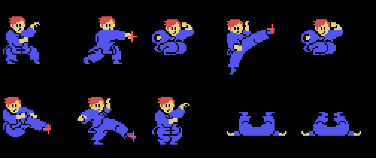

# Hallazgos

## El juego busca el Yie Ar Kung-Fu (RC-725) en la segunda ranura

Lo primero que hace INIT, antes incluso de instalar el gancho de interrupcion,
es llamar a `0xBF6C`. Ahi hay un rastreo de ranuras: recorre las cuatro
primarias de `0xFCC1`, entra en las subranuras cuando el bit 7 lo pide, conmuta
la **pagina 1** de cada una con `ENASLT` y le toma **dos sumas de 16 bytes**,
una desde `0x5300` y otra desde `0x6700`.

Las compara contra las dos parejas escritas en `0xBFD9`:

    5A 47   Yie Ar Kung-Fu (RC-725), la compilacion facil
    23 70   Yie Ar Kung-Fu (RC-725), la compilacion dificil

Reconoce **las dos compilaciones por separado**. Pasadas esas mismas dos sumas
por las demas ROM de esta serie no cuadra ninguna, asi que la identificacion no
es una suposicion.

Si lo encuentra, `(0xE450) = 1`. El **unico** sitio del juego que mira esa marca
es `0x74A3`, y ademas exige **nivel 3 o mas** (`0xE053`), **un solo jugador**
(bit 5 de `0xE002`, comprobado en `0x732F`) y la fase 3.

**Y ya se sabe que da.** Sale cuando las **dos** barras estan bajo minimos -la
del jugador por debajo de 9 y la del rival por debajo de 13, de `0x24` que es el
tope-: un cartel de 4x3 casillas (`0x7525`, fila 6 columna 14) y un **refresco**
que baja, el sprite de los cuatro bytes de `0x74F1`.

Cogerlo salta a `0x738C` con B = 1: `0x10` cuadros de descanso y, al agotarse,
`0x7356` deja la barra **del jugador** otra vez a `0x24`. La del rival no se
toca, y como `(0xE266)` queda a 1 nadie pierde una vida. Medido en openMSX: las
barras pasan de `(0x08, 0x0C)` a `(0x24, 0x0C)`.

Y **no tiene nada que ver con la sopa**: son dos piezas distintas, en dos
atributos distintos -`0xE250` la sopa y `0xE254` el refresco-, y la marca del
vecino no entra en el camino de la sopa por ningun sitio.

Esto no es la cabecera del Game Master: aquello es un cartucho leyendo un
*aparato de trucos*. Esto es un juego mirando a **otro juego**. Si Konami lo
hizo una vez puede estar en mas sitios, y la pista es un `call` muy temprano
desde INIT que toca `0xFCC1` y ENASLT.

## La sopa: hay que PEGAR en un sitio distinto en cada ronda

El cuenco humeante que deja invulnerable un rato no sale al azar, y el sitio no
es el mismo en todas las rondas.

Al empezar la ronda, `0x5027` copia a `0xE300` la pareja que le toca de una
tabla de **ocho** en `0x507A`, dos bytes por ronda: **fila y columna**. Esa
tabla ya estaba en el listado, sin saber de que era.

    ronda 1   (0x7E, 0x80)      ronda 5   (0x9E, 0x90)
    ronda 2   (0x8E, 0xE0)      ronda 6   (0x68, 0x10)
    ronda 3   (0x68, 0xD8)      ronda 7   (0x68, 0x80)
    ronda 4   (0x8E, 0x03)      ronda 8   (0x8E, 0x80)

Despues, un cuadro de cada dos, `0x73FD` pregunta si el jugador esta ahi. Pero
no mira donde esta el muneco: mira `0xE12C`, que es la **cuarta** de las cuatro
cajas que monta `0x684A` -la caja del **golpe**, la misma que `0x53B3` usa para
saber si el jugador alcanza al rival-. Tiene que caer dentro de una ventana de
**11x11** que empieza dos mas alla de la pareja.

Y esa cuarta caja **no existe en todos los fotogramas**:

De los diez dibujos de `0x6C83` solo la llevan el 1, el 3, el 5 y el 6, que son
los **cuatro ataques**. En los otros seis el guion trae `0x80`, `0x684A` deja la
caja a cero y el `and a` de `0x65C6` la tumba. O sea que no basta con ponerse en
el sitio: **hay que pegar** ahi.

Ademas, solo en la **fase 3** de la ronda -`0x733E` exige `(0xE107) = 3`, que es
lo que la tabla de `0x508A` da para `(0xE060) = 3`- y con **un solo jugador**
(`0x732F`).

**Lo que da.** `(0xE29E) = 0xA8`, que baja de uno en uno un cuadro de cada dos:
seis segundos y medio a 50 Hz. Mientras no valga cero:

| donde | que deja de pasar |
| --- | --- |
| `0x53F4` | el golpe del jugador no cuenta |
| `0x5588` | el rival no lanza nada |
| `0x566F` | lo que ya volaba se queda agarrado en vez de tocar |
| `0x7734` | no se rompen las ranuras |
| `0x798C` | nada toca al jugador |
| `0x6C1E` | y el muneco parpadea |

Ademas `coge_el_premio` suma 5 al byte de centenas del tanteo: 500 puntos. Y
**una sola vez por ronda**: al agotarse, `0x7496` deja `(0xE261) = 1` y la
escena 0 deja de preguntar.

**Comprobado en openMSX.** En la demostracion `(0xE300) = (0x7E, 0x80)`, la
primera pareja de la tabla. Moviendo el sitio encima del jugador -sin tocar un
byte del cartucho- el cuenco cae, y al tocarlo `0xE29E` se pone a `0xA8` y baja
hasta cero a 25 por segundo.

De paso, el listado tenia dos rutinas llamadas `mira_la_invulnerabilidad` y
`baja_la_invulnerabilidad` que **no** son eso: miran `0xE181`, que es la cuenta
del **agarre**. Por eso baja de cuatro en cuatro al pulsar disparo: es
forcejear. Ya estan renombradas.

## Media pantalla y un espejo

`0x597F` monta la pantalla de combate con cuarenta guiones apuntados por
cuarenta punteros repartidos en seis tablas contiguas, de `0x592F` a `0x597E`.
La biyeccion es exacta y las veinte parejas patron/color vuelcan lo mismo, las
veinte.

Pero solo se dibuja la mitad. `0x5A4D` copia tres tramos de la tabla de patrones
sobre si mismos pasandolos por `vuelve_los_bits`, y la mitad derecha del
decorado son los mismos dibujos con los ocho bits del reves. De ahi que **el
color se escriba dos veces y el patron una** -el espejo no toca colores- y de
ahi que las cuentas cuadren en las tres bandas: `0x0560-0x0260 = 0x300` y las
otras dos `0x3C0`, que es exactamente el desplazamiento de cada copia.

## Dos lectores de figuras que se parecen y no son iguales

`0x67F5` y `0x67A7` leen el mismo formato salvo en la orden `0xE0..0xEF`, y ahi
cambian de las dos maneras a la vez: el primero repite el byte que viene detras
y ocupa dos, y el segundo escribe ceros y ocupa uno.

Confundirlos no revienta: da una figura que casi encaja y se pasa por dos o tres
bytes por figura. Lo que demuestra cual es cual es que las **treinta figuras de
las oleadas encajan solo con el primero** y los bloques de los rivales solo con
el segundo.

## Los ocho rivales

Cada escenario tiene el suyo, y cuelgan de dos tablas de ocho que se indexan
igual: `0x6922` los fotogramas y `0x7FDB` el comportamiento. Cada bloque son 22
punteros que cierran a 44 bytes, y los **168 tramos entre entradas consecutivas
teselan sin un hueco ni un solape**, los 168.

El **fotograma impar es el par mirando al otro lado**: el `bit 0,a` de `0x677C`
sigue un puntero de dos bytes en vez de leer un dibujo, y el mismo bit niega la
x en `0x686A`.

## El muneco son ocho sprites, y la mitad se calcula

Un fotograma de LEE YOUNG son cuatro CAJAS DE GOLPE mas hasta ocho trios
`[y][x][patron]`, colgados de los veinte punteros de `0x6C83` -diez dibujos en
las entradas pares y diez remisiones de dos bytes en las impares-.

Las cuatro cajas de delante tienen el formato de un sprite -`[y][x]` y dos
bytes mas- y por eso es facil confundirlas con uno, pero no lo son: acaban en
`0xE120`, y la tabla de atributos de sprite en RAM es `0xE080..0xE0FF`, los
`0x80` bytes que `0x500F` aparca con `0xE0` en la y. Quien las lee es el codigo
de choques: `se_tocan` (`0x654F`) recorre **tres** cajas de cuatro bytes -doce,
justo lo que ocupan las tres primeras entradas- y suma el tercer byte al primero
y el cuarto al segundo para sacar los dos bordes.

Mirando a un lado, los ocho sprites usan los **patrones 0 a 7**, que `0x6BE6`
sube a `0x1800` siguiendo hasta quince guiones que trae el propio fotograma;
mirando al otro, los trios traen numeros de patron que caen en el banco
**espejado** que dejo `espeja_sprites` (`0x490C`). Un dibujo, dos direcciones, y
solo una mitad guardada.

Los guiones de sprite **empiezan dos bytes antes** de lo que parecen: la palabra
que se lee como cola va delante y es el destino de VRAM que consume `guion_rle`
(`0x48E1`). Corregido de `0xA490` a `0xA48E`, y confirmado por un segundo
camino: los 34 punteros a guiones que llevan los fotogramas del jugador caen
todos en inicios de guion calculados por separado.

## Una pantalla de oleadas son cuatro bytes

La tira de `0x5BE8` que le toca al decorado trae ocho nibbles en cuatro bytes;
cada uno elige una de las treinta figuras de `0x5C64`, y las ocho se pintan en
fila de cuatro en cuatro columnas. Las pares salen del nibble bajo y las impares
del alto, que es lo que dice el `bit 0,b` de `0x5B9F`.

## Las rondas vuelven a empezar a las ocho, y la tira tiene diez

`0x44E4` llena `0xE2C0` con diez escenarios, del 0 al 9 en orden. Pero `0x430F`
sube la ronda y `0x4311` la compara contra 8, volviendo a cero. Las dos ultimas
entradas de la tira no se leen nunca.

## El truco de las vidas

`0x43B8` guarda las diez primeras pulsaciones desde el encendido y las compara
contra los diez bytes de `0x43ED`:

    01 04 04 02 02 02 08 08 08 08

Con el reparto de bits del PSG eso es **arriba una vez, izquierda dos, abajo
tres y derecha cuatro**, un 1-2-3-4. Si cuadra, `(0xE055)` pasa de 3 vidas a
`0x95`.

## Con dos jugadores, el segundo mando lleva al rival

Los cinco bits de `(0xE052)` entran directos en la tabla de 32 de `0x7DA2`,
exactamente igual que los del jugador en `0x6990`. Con un jugador se los inventa
`0x7E7E`.

## Las siete entradas por escenario son tramos de distancia, no estados

`0x6E1D` resta las dos x y clasifica el resultado en siete tramos con seis
cortes -tres fijos y tres leidos de la tira de `0x6E5F`-. O sea que cada
escenario tiene **su propio alcance**, y lo que parecia una maquina de estados
es una tabla de distancias.

## Una fila mas arriba de la que se pide

`pon_la_figura_en_la_pantalla` (`0x66F1`) baja 32 casillas **`fila - 1`** veces,
por el `dec a` de `0x66FB`. Una figura pedida en la fila 4 empieza en la 3, y la
fila 0 es la excepcion porque el `jr z` de `0x66F9` se salta el bucle entero.

No es una curiosidad: sin eso el logotipo del titulo cae cuatro filas mas abajo
y tres columnas mas a la izquierda de donde va, y el cotejo con la VRAM lo dice
-165 casillas mal antes, 0 despues-.

## La marca oculta y la segunda cabecera

Los ultimos quince bytes, cerrando en `0xBFFF`, llevan `RC-737` y el titulo en
katakana escrito del reves. Es la marca que **Manuel Pazos** descubrio en los
cartuchos de Konami, y este la lleva.

Y hay una segunda cabecera en `0x4010`, `"AB" 07 37`, para el **Konami Game
Master** de la otra ranura. El cartucho no la lee nunca.

## Codigo que no llama nadie

Cinco rutinas -`0x47B0`, `0x4875`, `0x488A`, `0x544F` y `0x6EB5`- no las nombra
ni un `call`, ni un `jp`, ni ninguna tabla.

## Dos rotulos que se estaban leyendo mal

- `0x447B` dice **LEE YOUNG**, el que se maneja, y los ocho de `0x4497` son los
  nombres de los rivales. Se habian leido como nueve guiones seguidos, que
  cuadraba en bytes -`0x447B + 94 = 0x44D9`- pero el segundo trozo no es un
  guion: es la tabla de ocho punteros mas el primer nombre.
- `0x572A` no es el rotulo de la pausa: dice **PERFECT 5000**, y solo se pinta
  cuando la fase acaba con la barra llena (`0x5328` contra `0x24`).
